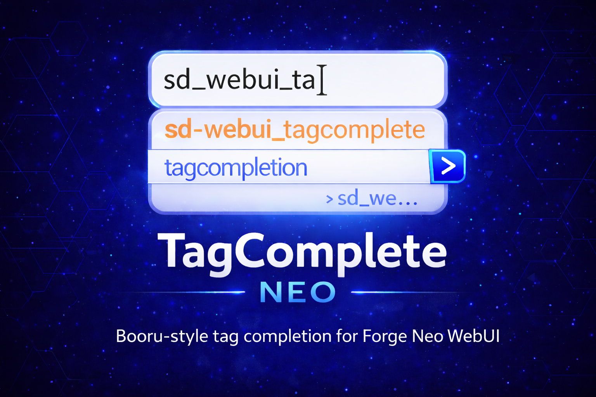

> **Extension for [Stable Diffusion WebUI Forge - Neo](https://github.com/Haoming02/sd-webui-forge-classic/tree/neo)**

# 🏷️ TagComplete Neo

Tag autocompletion for Forge Neo — suggests Danbooru/e621 tags, LoRA/embedding names, wildcards, and chants as you type, with automatic trigger word injection and CivitAI lookup support.

Fork of [a1111-sd-webui-tagcomplete](https://github.com/DominikDoom/a1111-sd-webui-tagcomplete) by [DominikDoom](https://github.com/DominikDoom), maintained here exclusively for Forge Neo. If you are not running Forge Neo, use the [original extension](https://github.com/DominikDoom/a1111-sd-webui-tagcomplete) instead.

---

## 📋 Table of Contents

- [What's New](#-whats-new)
- [Changelog](#-changelog)
- [Roadmap](#️-roadmap)
- [Features](#-features)
- [Installation](#-installation)
- [Tag Lists](#-tag-lists)
- [Credits](#-credits)

---

## 🆕 What's New

### v0.1.0 — Forge Neo Baseline

- **Full Forge Neo compatibility** — extension loads and runs correctly on Forge Neo without crashes or silent failures
- **Booru tags restored** — tag suggestions now appear correctly in the prompt box
- **Reliable initialization** — autocomplete activates on every WebUI launch, including the second and beyond
- **Instant embedding reload** — embeddings update without restarting the WebUI
- **Trigger word auto-fetch from CivitAI** — if a LoRA has no local trigger words set, the extension can look them up automatically from CivitAI ⭐
- **Trigger word cache by file hash** — fetched words are saved alongside the model and only re-fetched when the file itself changes ⭐
- **"After LoRA/LyCO" insertion position** — new option to place trigger words immediately after the `<lora:…>` token instead of only at the start or end of the prompt ⭐

---

## 📖 Changelog

### v0.1.0 — Forge Neo Baseline
- Full Forge Neo / Gradio 4 compatibility
- Booru tags, initialization, and embedding reload fixed
- CivitAI trigger word lookup with SHA256 cache
- "After LoRA/LyCO" insertion option

---

## 🗺️ Roadmap

### v0.1.0 — Forge Neo Baseline ✅
- Forge Neo / Gradio 4 compatibility ✅
- Booru tag display fixed (Gradio 4 selectors) ✅
- Reliable re-initialization after WebUI reconnect ✅
- Embedding reload hardened ✅
- Extension resilience after Forge updates ✅
- CivitAI trigger word lookup with SHA256 cache ✅
- "After LoRA/LyCO" insertion option ✅

### v0.2.0 — Tag Data Update *(planned)*
- Updated Danbooru and e621 tag lists with current data
- Better tag coverage for Pony, NoobAI, and Illustrious-based models
- Fix for frequency database failing to create on first run

### v0.3.0 — UX Improvements *(planned)*
- Sort suggestions by relevance to tags already in the prompt
- Use multiple tag list files at the same time

### v0.4.0 — Smart Matching *(planned)*
- Fuzzy matching — type abbreviations like `detco` to find `detached_collar`
- Automatically switch tag list based on the currently loaded model

### v1.0.0 — First Stable Release *(planned)*
- All known issues resolved
- Full Forge Neo compatibility guarantee

---

## 🎯 Features

> ⭐ = added or fixed in this Neo fork · everything else is original work by [DominikDoom](https://github.com/DominikDoom)

### 🏷️ Tag Autocompletion

- **Instant suggestions** as you type, sourced from Danbooru, e621, or merged lists
- **Keyboard navigation** — arrow keys, Tab, Enter, Escape, all configurable
- **Tag color coding** by category, with post count for relevance
- **Alias and translation search** — find tags by their alternate names or translated terms
- **Frequency sorting** — remembers your most-used tags and promotes them to the top ⭐

### ➕ Extra Networks

- **LoRA and LyCORIS autocomplete** triggered by `<`
- **Embedding autocomplete** triggered by `<e:`
- **Thumbnail preview** in the completion popup
- **Trigger word injection** on LoRA selection — inserts activation keywords automatically
  - Fetches from CivitAI if not set locally ⭐
  - Cached by SHA256 — only re-fetched when the model file changes ⭐
  - Configurable position: Start of prompt, End of prompt, Before or After the LoRA token ⭐

### ✳️ Wildcards

- **Wildcard file autocomplete** triggered by `__`
- **Nested folder support**
- **YAML wildcard format** (UMI-compatible)

### 🪄 Chants

- **Prompt preset completion** for longer phrase templates stored in JSON files
- Triggered by `<c:` or `<chant:`

---

## 📦 Installation

1. Open Forge Neo WebUI
2. Go to **Extensions** → **Install from URL**
3. Paste: `https://github.com/eduardoabreu81/sd-webui-tagcomplete-neo`
4. Click **Install** and reload the WebUI

> ⚠️ This extension requires **Forge Neo**. It will not work on Automatic1111 or Forge Classic.

---

## 🗂️ Tag Lists

| File | Source | Best for |
|---|---|---|
| `danbooru.csv` | Danbooru top-100k | Anime models (SD 1.5, SDXL) |
| `e621.csv` | e621 top-100k | Furry / anthro models |
| `danbooru_e621_merged.csv` | Merged + unified categories | Pony, NoobAI, Illustrious |
| `extra-quality-tags.csv` | Curated set | Quality booster tags |
| `EnglishDictionary.csv` | English dictionary | Photorealistic / non-booru models |

To switch lists, change **Tag filename** in **Settings → Tag Autocomplete**.

---

## 📄 Credits

- **[a1111-sd-webui-tagcomplete](https://github.com/DominikDoom/a1111-sd-webui-tagcomplete)** by DominikDoom — original project, all core functionality
- **[sd-webui-tagcomplete-neo](https://github.com/eduardoabreu81/sd-webui-tagcomplete-neo)** by [Eduardo Abreu](https://github.com/eduardoabreu81) — Forge Neo fork
- **[Forge Neo](https://github.com/Haoming02/sd-webui-forge-classic/tree/neo)** by Haoming02

---

## 📜 License

MIT — see [LICENSE](LICENSE)

---

Made with ❤️ for the Stable Diffusion community

**[Report Bug](https://github.com/eduardoabreu81/sd-webui-tagcomplete-neo/issues)** • **[Request Feature](https://github.com/eduardoabreu81/sd-webui-tagcomplete-neo/issues)** • **[☕ Ko-fi](https://ko-fi.com/eduardoabreu81)**

